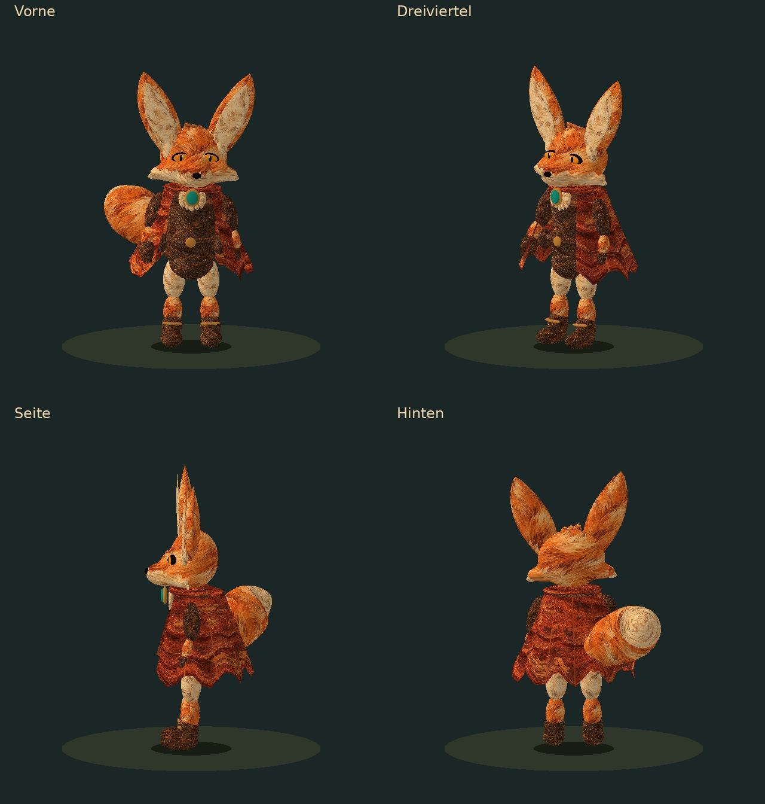
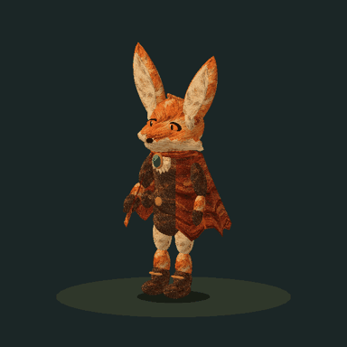

# Echter 3D-Fennec: begrenzter Kotlin-Prototyp

## Zweite Formfassung nach Puppen-Kritik

Martin beschreibt die erste Fassung als Puppe. Die zweite Fassung vereint
Schaedel, Wangen, Kiefer und Schnauze zu einer geschlossenen, geglaetteten
Oberflaeche statt einzelner Kugeln. Schmalere Koerpermitte, kleinere Stiefel,
Fellspitzen, leicht asymmetrische Ruhehaltung und eine gefaltete, unregelmaessige
Cape ersetzen die glatten Spielzeugformen. Perlen-Saum, dicker Kragen und
angesetzte runde Wangen entfallen. Fell, Blattstoff und Leder erhalten echte
UV-Texturen aus einem gemalten Atlas; die weiteren Farben bleiben Materialfarben.
Die Zeichnung ist weiterhin eine vereinfachte Formstudie der Vorlage.

Martin hat nach der Entfernung von Teich und Schwimmen einen echten Modelltest
beauftragt. Dieser Schnitt liegt auf PR #355 / `346d6dbf` und fuegt eine getrennte
Testansicht hinzu. Die Spiel-Figuren werden damit noch nicht ersetzt.





## Ausprobieren

- **Ohne Installation:** `preview.html` herunterladen und lokal im Browser mit
  WebGL oeffnen. Die Datei ist vollstaendig, braucht keinen Server, keine
  externen Skripte und keine Internetverbindung. Stehen, Gehen, Laufen, Pause,
  Ansichtsregler und automatische Rundumdrehung. Der Downloadknopf gibt genau
  das enthaltene GLB-Modell aus.
- **Kotlin/Game:** `./gradlew :app-sim:assembleGame`; im Startbildschirm
  **3D-Fennec testen** oeffnen. Zurueck fuehrt zur Charakterauswahl. Nur dieses
  Oeffnen laedt das Modell und erzeugt den GL-Kontext. Der separate Test schreibt
  keinen Spielstand. Die Variante setzt den Wasser-entfernen-Stand fort.
- **Modell:** `app-sim/src/game/assets/models/fennec-prototype.glb`.
  glTF 2.0 mit normalen Mesh-Oberflaechen, Materialfarben, Normalen und drei
  Animationsclips. Kein Billboard, kein Bitmapnetz, keine Sprite-Sequenz.
  Dieses transportable Format erlaubt einen spaeteren Vergleich in Godot oder
  Blender; dieser Import ist hier noch nicht ausgefuehrt worden.

## Was umgesetzt ist

Die Referenz ist `tools/character-art/source/fennec_key.png`: orange/cremefarbener
Fuchs, grosse Ohren, rote Blatt-Reisecape, braune Kleidung, Stiefel und tuerkise
Brosche. Der Prototyp vereinfacht die gemalte Vorlage bewusst; er prueft zuerst
Volumen und den Android-Zeichenweg. Ein renderbares Modell ist das Ergebnis,
noch keine fertig abgestimmte Produktionsfigur.

- 31.600 Dreiecke, 16 hierarchische Knoten, 1.530.816 Byte GLB (1,46 MiB),
  einschliesslich eingebetteter Materialtextur.
- Bewegliche Hueften, Knie, Fussgelenke, Schultern, Ellenbogen, Kopf, Mantel
  und Schwanz. Starre Teilmeshes an Gelenken; **kein gewichtetes Haut-Skinning**.
- `idle`, `walk`, `run` als echte glTF-Rotationsspuren mit SLERP. Gang am Platz;
  keine Weltbewegung, Bodenkollision oder Foot-IK in diesem Test.
- GLSurfaceView/OpenGL ES 2 in Kotlin, Tiefenpuffer, Normalenlicht und feste
  orthografische Kamera. Drehen aendert die Modellrichtung, nicht die Kamera.
- Rundes Bodenpodest und vereinfachte feste Kontaktmarkierung, keine dynamische
  Schattensimulation. Blattadern liegen als schmale Geometriebaender auf der Cape.
- 30-Hz-Anforderung in der Android-Testansicht; Rendering und Animationszeit
  stoppen beim Verlassen. GL-Ressourcen werden nach Kontextverlust neu aufgebaut.
- Keine neue Produktionsbibliothek, kein Build-/Workflowumbau. GLB nur im
  Game-APK; identische Testkopie ausschliesslich im Android-Test-APK.
- In der nativen Testansicht wird der 1254er Atlas mit `inSampleSize = 2`
  dekodiert: 627 x 627 Pixel, rechnerisch rund 1,5 MiB RGBA-Texel. Diese Textur
  kommt zum vorherigen Modellbudget hinzu; das ist keine gemessene Gesamt-RAM-
  oder Ladezeitangabe. Browser/Mesa verwenden den vollstaendigen Atlas.

## Reproduzieren

```bash
python3 -m pip install numpy scikit-image
python3 tools/fennec-3d/build_model.py
```

NumPy/scikit-image verschmelzen die Kopfformen offline per Dichtefeld; keine
Modellerzeugung zur Laufzeit auf dem Telefon. Erzeugt Game-GLB, identisches Test-GLB und die
selbststaendige HTML-Vorschau aus `preview.template.html`.
Gemalter Projektatlas und exakter ImageGen-Prompt:
[`tools/fennec-3d/materials/README.md`](../../tools/fennec-3d/materials/README.md).

```bash
python3 -m pip install numpy moderngl Pillow
python3 tools/fennec-3d/render_preview.py
```

Die Bilder stammen aus dem wirklichen GLB mit Tiefenpruefung und animierten
Knoten auf Mesa/EGL, nicht aus einem Bildgenerator. Der Python-Renderer ist
ein Entwicklungswerkzeug und wird nicht mit dem Spiel ausgeliefert.

## Pruefung und Grenzen

- Khronos glTF Validator `2.0.0-dev.3.10`: **0 Fehler, 0 Warnungen**.
  Ein Informationshinweis auf die Nicht-Zweierpotenz-Groesse des Atlasses ist
  erwartet; `CLAMP_TO_EDGE` und Filter ohne Mipmaps sind bewusst gesetzt.
- Neue Activity, Renderer und GLB-Leser mit Kotlin 2.2.20 gegen Android-API-JAR
  uebersetzt. Das ist kein vollstaendiger Gradle-/Compose-/APK-Bau.
- 12 JUnit-Pruefungen lokal bestanden: 3 reine Quaternion-Tests und die 9
  Modellpruefungen mit Datei statt Android-Asset als Bytequelle. Pruefen echte
  Tiefe, endliche Einheitsnormalen, Indizes, Hierarchie, gegenlaeufige Beine,
  unveraenderte Gelenklaengen, Clip-Loops, Quaternionen und falschen GLB-Header.
  Zusaetzlich JPEG-Daten und UV-Grenzen/Zuordnung der Textur.
  Der Android-Asset-Weg dieser 9 Tests braucht den Emulator:
  `./gradlew :app-sim:connectedDebugAndroidTest`.
- Die vier Ansichten und die Rundum-Gehanimation wurden visuell kontrolliert.
- Chromium/WebGL: drei Bewegungen, Ansichtswechsel, Pause/Weiter, Rundumdrehung
  und schmaler 390-Pixel-Bildschirm geprueft; keine JavaScript-/GL-Fehler.
- Die erste Fassung `c312d034` hat Verify/Android-CI erfolgreich bestanden.
  Diese zweite Fassung wird erneut geprueft.
- Noch offen: Telefon-/Emulatortest von Activity, Zurueck, Pause/Fortsetzen,
  Kontextverlust und Endgeraeteleistung; keine gemessene Android-Ladezeit,
  kein GPU-/RAM-Profil und keine neue APK ausgeliefert.
- Genauere Gesichtsaehnlichkeit, weiche Gelenkuebergaenge,
  tragende Schritte/IK und Stoffsimulation sind weitere Modellarbeiten. Ein
  Wechsel zu Godot ist mit diesem Test noch nicht entschieden.

Naechste Abnahme: dieselbe Figur auf dem Telefon von allen Seiten und in der
Gehbewegung beurteilen; erst danach die Spielfigur integrieren oder einen
vergleichbaren Godot-Test bauen. Ruecksetzung: diesen separaten Prototyp-Schnitt
rueckgaengig machen; der trockene Kuestenstand aus PR #355 bleibt dessen Basis.
