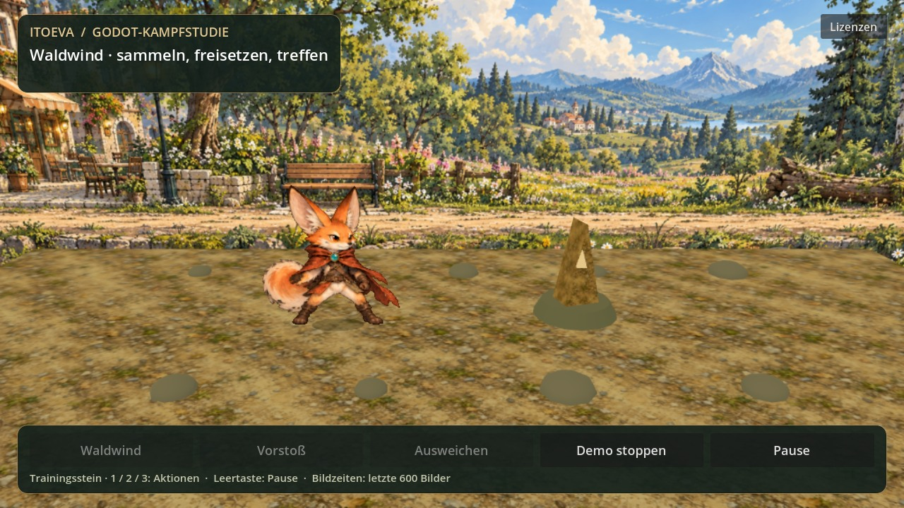
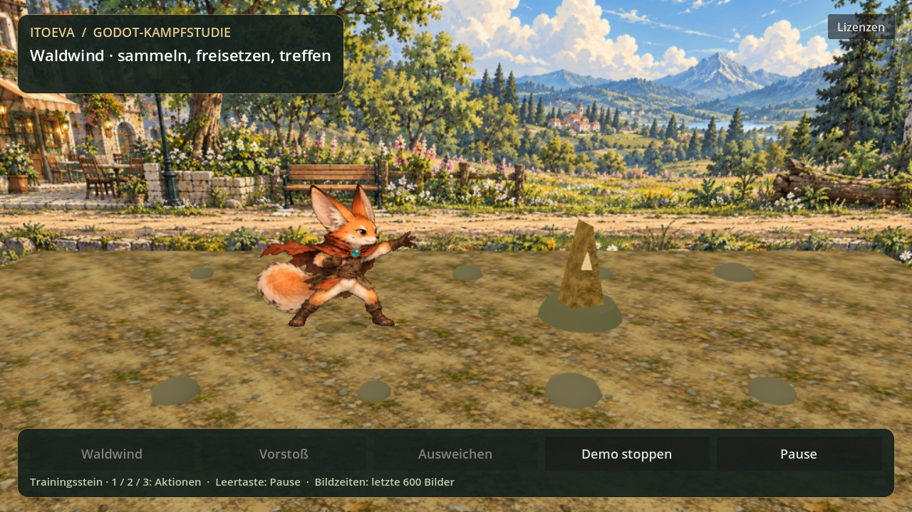

# Godot-Kampfstudie: tatsächliche Engine-Ausgabe

Die Bilder und der Film stammen aus **Godot 4.5.1**, OpenGL/Mesa llvmpipe, 1280×720.
Sie sind weder Concept Art noch eine nachgebaute HTML-Animation. Quellprojekt:
[godot-combat-prototype](../../godot-combat-prototype/README.md).

[Kampfstudie als MP4](kampfstudie.mp4): Waldwind, Vorstoß und Ausweichen, 6,33 Sekunden.
Die Engine-Aufnahme nutzt einen **festen 60-Hz-Zeitschritt** und brauchte rund 20 Sekunden
zum Rendern/Encodieren. Sie zeigt die Bewegungsabfolge, **keine 60-FPS-Echtzeitleistung**.
Die aufgenommenen UI-Hinweise sagen dasselbe. Posewechsel sind etwa acht Zeichnungen/s;
räumliche Bewegung und Effekte erhalten pro Renderbild einen neuen Zustand.

## Getestet am gelieferten Quellstand

- Headless-Import und GDScript-Aktions-/Eingabeprüfung: keine Fehler.
- Gleiche Aktionsergebnisse bei 15/30/60/120 Hz und bei einem großen Zeitsprung.
- Keine doppelten Aktionsstarts/Treffer, Rückkehr nach Vorstoß/Ausweichen, Pause/Weiter
  über den echten Eingabepfad, konstante Texturidentität und begrenzter Effektpool.
- Acht belegte transparente Atlaszellen ohne abgeschnittene Körper an den Zellgrenzen;
  beide Landschaft-/Materialdateien lesbar. Leichte Zeichnungsvarianz bleibt visuell sichtbar.
- Echtzeit-Softwaregrafik-Messlauf von 20 Sekunden, ohne festgelegtes Delta; neun abgeschlossene
  Aktionen, sechs Stein-Treffer, 36 Effekt-Meshes, 77 Nodes und **0 neue Nodes**.
- Debug-APK für arm64 exportiert; Signatur v2/v3 und ZIP-Ausrichtung einschließlich
  16-KiB-Native-Library-Ausrichtung geprüft. Paket getrennt, keine Netzwerkberechtigung.

Aus [benchmark.json](benchmark.json), letzte 600 tatsächliche Bildintervalle:

| Messgröße | Lokaler Befund |
| --- | --- |
| Mittleres Bildintervall | 25,01 ms, etwa 40 Bilder/s |
| p95 | 30,18 ms |
| Intervalle über 33,34 ms | 10 von 600 |
| Erstes gerendertes Bild seit Engine-Start | 578 ms, mit bereits warmem Dateicache |
| Godot-Texturspeichermonitor | 40.247.423 Bytes; kein gemessener Gesamt-RAM-Verbrauch |
| Renderer | Compatibility, Mesa llvmpipe, vier Software-Renderthreads |

Diese CPU-Softwaregrafik ist **keine Android-GPU** und keine kontrollierte Messung gegen
die Kotlin-App. Sie beweist weder bessere Handy-FPS noch Ruckelfreiheit. [probe.json](probe.json)
enthält reale Bildintervalle während der Filmaufnahme einschließlich Encoding. Der feste
Animationszeitschritt macht diese Aufnahme ausdrücklich zu keiner Echtzeit-Leistungsmessung.
Physische Touchbedienung, Android-Start, Hintergrund/Rückkehr, thermische Dauerlast und
Telefonbildzeiten bleiben ungeprüft. Die APK zeigt dafür reale Bildzeiten.

## Handhabung und Grenze

In der APK **Demo starten** und anschließend die drei Einzelaktionen prüfen. Der Stein
bleibt ein Testempfänger. Keine vollständige Kampf-/Weltportierung; keine persönlichen
Daten, keine Spielstände, kein Living Agent, kein Wasser-/Schwimmsystem.
Stil und Fußkontakt zuerst beurteilen; Zwischenbilder und eigenständige Ausweich-/Nahkampf-
Animationen sind der nächste grafische Schritt. Engine-Leistung ersetzt diese Zeichnungsarbeit nicht.
