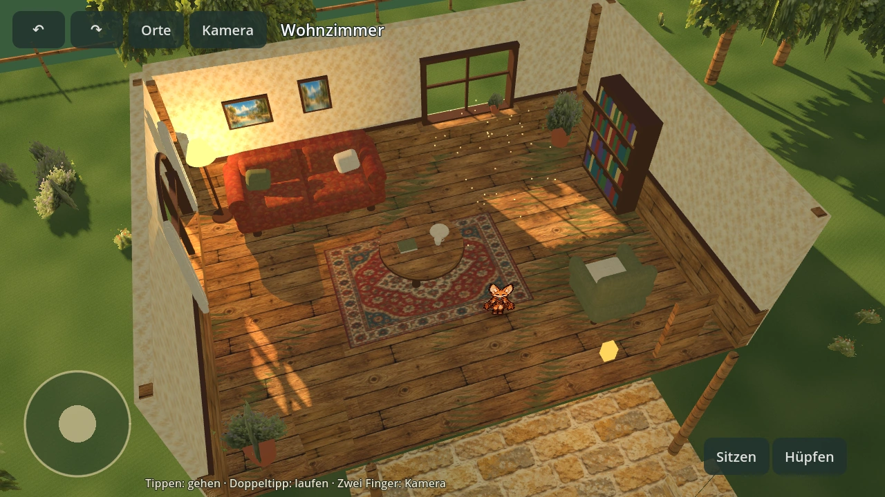
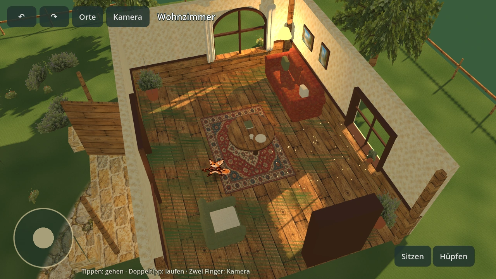
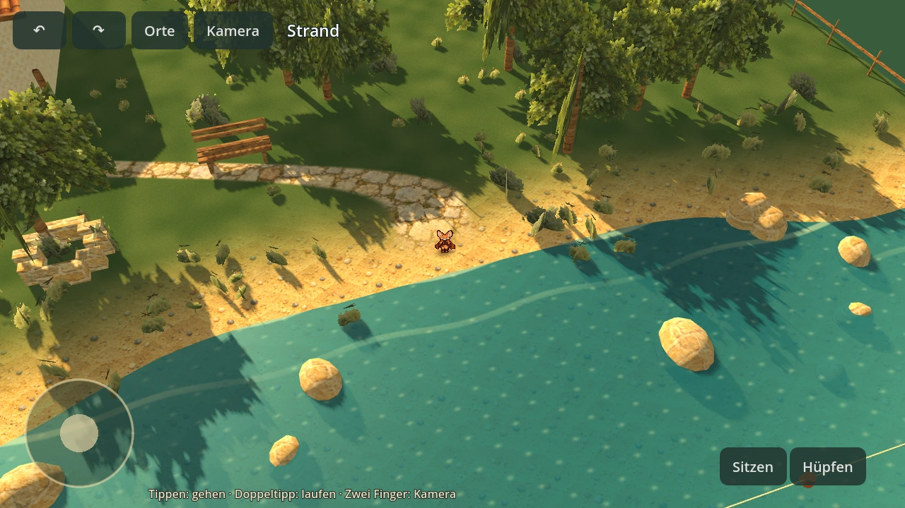

# Echte Godot-Renderbilder

Diese Bilder stammen aus Godot 4.4.1 mit Software-OpenGL, nicht aus einer Bildgenerierung.
Die beiden Innenansichten zeigen dasselbe Zimmer bei gedrehter Kamera. Der Strand ist Teil
desselben begehbaren Geländes. Die Wegprüfung lief zusätzlich mit `--validate` und `--probe`.

