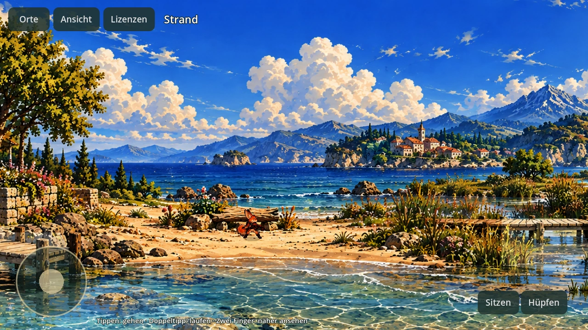
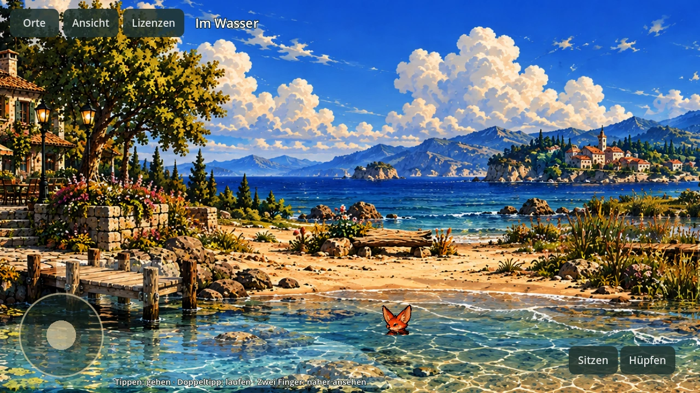
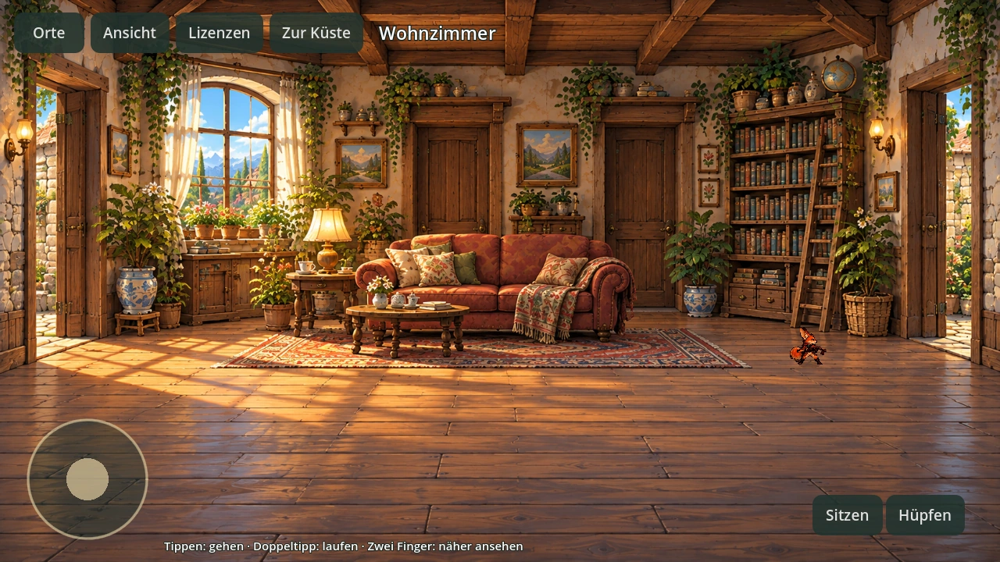
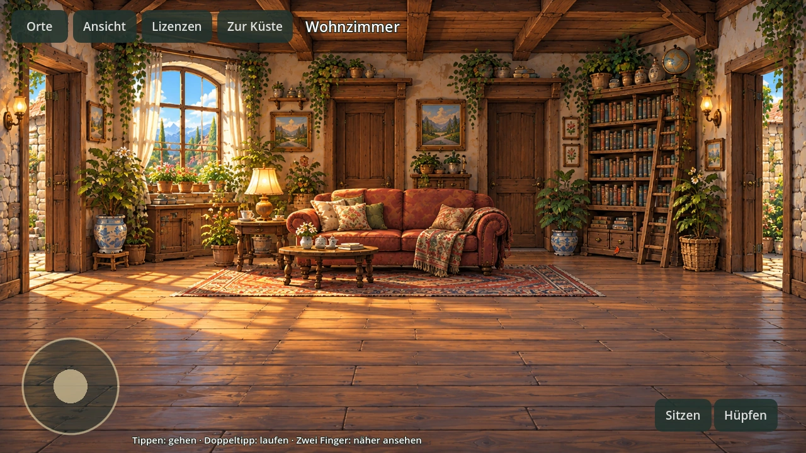

# Gemalte 2D-Welt: echte Godot-Ansichten

Godot 4.4.1, Compatibility/OpenGL (Mesa llvmpipe), 1280×720. Diese Ansichten stammen aus
`--probe` während eines echten Wegtests. Die Bilder wurden nicht als Konzeptvisualisierung
neu generiert. Die originale Küste und das originale Wohnzimmer bilden die sichtbare Welt.

## Küstenpanorama

## Begehbare Raumtiefe

Die Kamera zeigt innen den Raum als bereits geladene Innenansicht. Ein-/Austritt läuft über
denselben Bodenpunkt; auf dem Rückweg bleiben beide Bilder und sämtliche Nodes erhalten.
Die Türansicht ist ein aufklappbarer Innenraum, kein durch neue Ladesequenzen getrennter Level.
Dieser Stand enthält einen Innenraum und das Küstenpanorama. Weitere Räume und Panoramen
sowie eine Geräteprüfung auf dem Telefon folgen separat.
