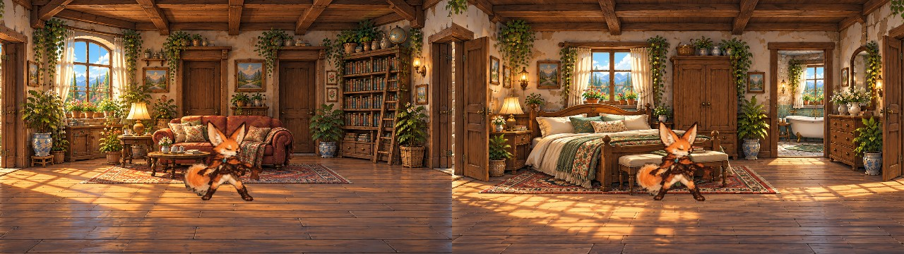

# Warme Innenraeume und unsichtbare Laufkarte (10.10.2026)

Martin beanstandet den Abstand zwischen warmer Concept Art und den tatsaechlichen
Innenraeumen, zu viel leeren Vorderboden und Laufwege durch Kulisse, Moebel oder
Wasser. Branch `codex/painted-interiors-walking-map`, auf PR #351 (`8865522`) aufgebaut.

## Umsetzung

- Alle elf Innenorte zeichnen wieder die vorhandenen warmen Originalmalereien
  aus `interiors/*.png`. Die prozedurale Pixelkulisse bleibt nur ein Fallback.
  Keine zusaetzlichen generischen Vorhaenge oder geschlossenen Pixel-Tuerblaetter
  uebermalen diese Bilder. Gemalte Stoff-/Pflanzenausschnitte und Ortslicht bewegen
  sich weiter. Fenster-/Tuerausschnitte folgen ihren Bildpositionen.
- Innenraumkamera: 1,12-facher Zoom, Blickmitte etwa Bildzeile 122 statt Mitte 135.
  Vorderer Laufboden endet bei 236 statt 256. Der seitliche Kameranachlauf erhaelt
  den Zugang zu Randtueren. Wandboden wird begrenzt, Tueranker bleiben zugaenglich.
- `GameWalkingMap` haelt je Landschaft vermessene hintere/vordere Bodenkanten,
  Sperrpolygone und Graspolygone in Originalbildkoordinaten. Region/Ortsabschnitt
  teilen dasselbe Koordinatensystem. Bestehendes Brueckenprofil und Ufer-/Steg-/
  Felsmasken werden weiter verwendet; alle Landschaftsnaehte bleiben stetig.
- Bewegung, automatischer Anlauf und gespeicherte Einstiegsposition lesen dieselbe
  Karte. Bodenpfade werden alle zwei Bildpixel geprueft. Moebel werden analytisch
  entlang des gesamten Bewegungsschritts geschnitten, statt nur am Endpunkt.
  Anlaufknoten entlang des Korridors und um Sperrpolygone vermeiden Abkuerzungen
  durch die Brueckenboeschung oder vordere Felsen. Alte Positionen werden beim
  Betreten auf freien Boden gesetzt; das Speicherformat bleibt unveraendert.
- Moebel behalten bildgebundene Silhouetten, Grundrisse, Sitz-/Landekanten und
  Hoehen. Bett, Sofa, Schrank und Kommode wurden an die Originalbilder angepasst.
  Stuehle/Banken verdecken durch Ruecken und Beine statt durch ein volles Rechteck.
  Springen/Landen verwendet weiterhin den vorhandenen Motor und diese Flaechen.
- Nur die kartierten Grasraender erzeugen Grasmaterial: Halmverformung reagiert auf
  echte Fusskontakte, klingt binnen 1,2 Sekunden ab und laesst die Pfoten teilweise
  hinter den Halmen verschwinden. Ein Weg wird nicht pauschal als Gras behandelt.
- In kartiertem Wasser beginnt sofort Schwimmen/Wassertreten mit Verlangsamung und
  Unterwasserverdeckung. Stege und Felsen bleiben fest. Sitzen/Rollen hat auf Wasser
  keinen Bodenhalt; Hintergrundwasser ausserhalb der Karte bleibt unerreichbar.

## Pruefung und Vorschauen

```bash
bash tools/reaction-preview/tests.sh
bash tools/world-art/preview_walking_map.sh
```

`WORK=/pfad/zum/compiler-cache` kann fuer beide Skripte denselben Cache angeben.
Die Vorschau liest die produktiven Kotlin-Koordinaten und die Originalassets.



[Laufkarte aller sieben Landschaften](../tools/world-art/walking-map-preview.jpg):
Gruen = Boden, Blau = Schwimmen, Rot = Hindernis, Gelbgruen = Gras. Die Farbkarte
ist ein Diagnoseexport und wird im Spiel nicht eingeblendet. Innenraumvorschau
ist eine Softwarevorschau ohne native Licht-/Stoffanimation und ohne Bedienoberflaeche.

Gezielte Logiktests pruefen Sperrinseln zwischen legalen Endpunkten, Anlauf um
Fels/Kiste, sehr schmale Moebel, sofortigen Wasserwechsel, abklingende Grasreaktion,
kompakte Kamera, alle Tueren und stetige Landschaftsanschluesse. Der native
Android-Test vergleicht Stichproben des echten Raumzeichenwegs mit der geladenen
Bitmap (im Debug-Emulator eine Testbitmap, weil dessen APK keine Game-Assets packt).

1.049 lokale reine Kotlin-Tests bestanden. Beide Vorschauen wurden visuell geprueft.

Die Karte ist handvermessen, keine automatische Pixel-/Tiefenerkennung. Niedriges
Gras bekommt eine Kontaktreaktion; es wird nicht jede einzelne Pflanze simuliert.
Telefonabnahme fuer Bildrate, Seitenformat, Sprung-/Sitzwirkung und Uferdetails ist
offen. Android-Build und Emulatorpruefung folgen ueber die unveraenderte PR-CI.
Keine APK wurde in diesem Auftrag gebaut oder installiert.
